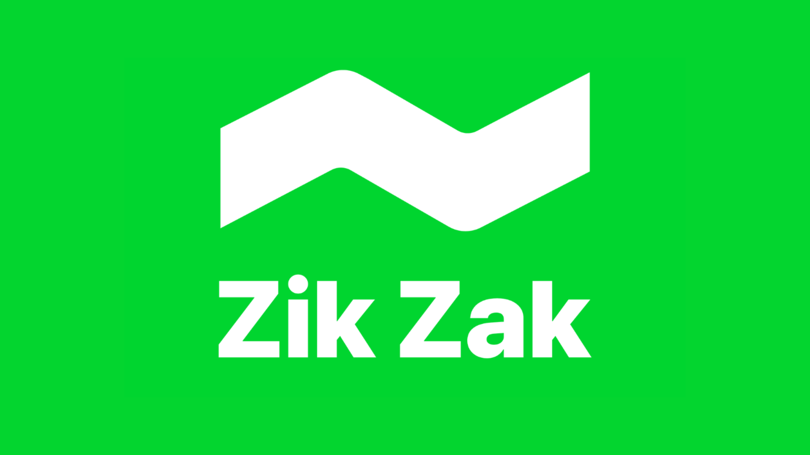

# zikzak_json

A best-effort JSON parser for Dart. Uses `simdjson_dart` for speed on
standard JSON and falls back to `json5_plus` for comments, trailing commas,
unquoted keys, and numeric object keys. The caller never needs to think
about which engine is running — `zikzak_json` handles everything and always
returns clean raw Dart types (`Map`, `List`, `String`, `num`, `bool`, `null`).

[](https://pub.dev/packages/zikzak_json)
[](LICENSE)

---

## Features

- **Dual-engine architecture** — simdjson for strict JSON (>3x faster), json5_plus for everything else
- **Transparent fallback** — feed it any JSON or JSON5, get raw Dart types back
- **Fast-path heuristic** — detects JSON5 features (comments, unquoted keys, trailing commas) in the first 4KB to skip simdjson when failure is predictable
- **No `Json5` wrapper objects** — recursive `toRaw()` conversion strips wrapper types so you always get plain `Map`/`List`/primitives
- **Extract paths** — dot-notation or JSONPath extraction without full document traversal
- **Thread-safe** — all decode calls are independent, no mutable global state

## Getting started

**zikzak_json** is a pure Dart package with zero Flutter dependencies.

```yaml
dependencies:
  zikzak_json: ^0.1.0
```

## Usage

### Basic decode

```dart
import 'package:zikzak_json/zikzak_json.dart';

// Standard JSON → simdjson (fast path)
final data = ZikZakJson.decode('{"a": 1, "b": "hello"}');
print(data['a']); // 1

// JSON5 with comments → auto-detected, json5_plus path
final config = ZikZakJson.decode('''
{
  site: "lowes",          // unquoted key
  channel: "mobile",
  timeout: 2000,          // trailing comma
}
''');
print(config['site']); // "lowes"

// Numeric keys → json5_plus handles what simdjson rejects
final cats = ZikZakJson.decode('{102717: "PADLOCKS"}');
print(cats['102717']); // "PADLOCKS"
```

### Convenience methods

```dart
final map = ZikZakJson.decodeMap('{"a": 1}');     // throws if not object
final list = ZikZakJson.decodeList('[1, 2, 3]');   // throws if not array
final str = ZikZakJson.decodeString('"hello"');    // throws if not string
```

### Detection helpers

```dart
ZikZakJson.isJson('{"a": 1}');   // true
ZikZakJson.isJson('hello');      // false
ZikZakJson.isJson5('{a: 1}');    // true  (valid JSON5, not valid JSON)
ZikZakJson.isJson5('{"a": 1}');  // false (valid JSON, not JSON5-only)
```

### Options & engine selection

```dart
// Force a specific engine
ZikZakJson.decode(source, options: ZikZakJsonOptions(
  forceEngine: ZikZakJsonEngine.json5,  // skip simdjson
));

// Strict mode — throw on first failure, no fallback
ZikZakJson.decode(source, options: ZikZakJsonOptions(
  strict: true,
  forceEngine: ZikZakJsonEngine.simdjson,
));

// Verbose timing
ZikZakJson.decode(source, options: ZikZakJsonOptions(verbose: true));
```

### Path extraction

```dart
final json = ZikZakJson.decode(largePayload);
final brand = ZikZakJson.get(json, 'itemList.0.product.brand');
// → "Master Lock"
```

### JSONPath queries

`json_path_plus` is re-exported, so the same single import covers decoding and
querying — no second dependency needed:

```dart
import 'package:zikzak_json/zikzak_json.dart';

final json = ZikZakJson.decode('{"itemList":[{"brand":"Master Lock"}]}');
final brands = JSONPath.query(r'$.itemList[*].brand', json, wrap: false);
// → ["Master Lock"]
```

Full JSONPath-Plus syntax (filters, native `@property` accessors, slicing) is
documented in [`json_path_plus`](https://pub.dev/packages/json_path_plus).

## Engine Architecture

```
Input String
    │
    ├── forceEngine == simdjson ───→ simdjson_dart ──→ raw types
    │
    ├── forceEngine == json5 ──────→ json5_plus ─────→ toRaw() ──→ raw types
    │
    └── auto (default)
          │
          ├── fast-path heuristic
          │     └── JSON5 indicators? ──yes──→ json5_plus
          │
          └── try simdjson_dart
                ├── success ──→ return
                └── fail ─────→ json5_plus fallback
```

### Why two engines?

| Engine         | Speed        | Input flexibility                                                 | Use when                                    |
| -------------- | ------------ | ----------------------------------------------------------------- | ------------------------------------------- |
| **simdjson**   | ~3-5x faster | Strict JSON only                                                  | Large payloads, APIs, guaranteed valid JSON |
| **json5_plus** | Slower       | JSON + comments + unquoted keys + trailing commas + single quotes | config files, human-written JSON5           |

## Similar packages

- [`json5`](https://pub.dev/packages/json5) — Standard JSON5 parser, rejects numeric object keys (`102717: "val"`)
- [`json5_plus`](https://pub.dev/packages/json5_plus) — JSON5 parser with typed accessors and `$include` support
- [`simdjson_dart`](https://pub.dev/packages/simdjson_dart) — Raw simdjson bindings for Dart

---

## Powered by ZikZak AI

zikzak_json is developed by **ZikZak AI** to serve as the JSON backbone for high-throughput price comparison, and data extraction workloads.

- 🌐 [zuzu.dev](https://zuzu.dev)
- 🐙 [GitHub](https://github.com/arrrrny/zikzak_json)
- 🐛 [Issue Tracker](https://github.com/arrrrny/zikzak_json/issues)

## Sponsors

[](https://zuzu.dev) [](https://zuzu.dev)

Thanks to ZikZak AI for sponsoring this project!

ZikZak AI is an AI-Powered Price Comparison app that you scan barcodes, and discover amazing savings instantly. Your personal shopping assistant that never sleeps.

<a href="https://apps.apple.com/tr/app/zik-zak/id1563425450"></a>
<a href="https://play.google.com/store/apps/details?id=dev.zuzu.zingo"></a>

---

Licensed under the [Apache License, Version 2.0](LICENSE).
